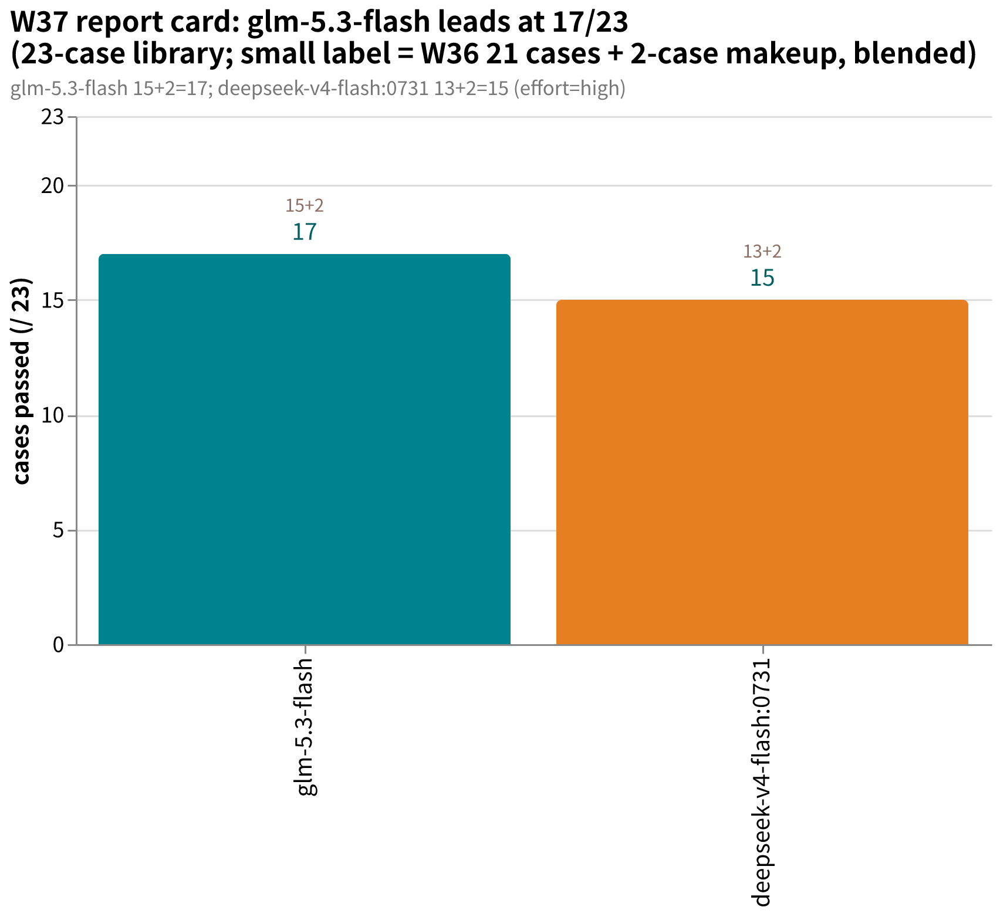
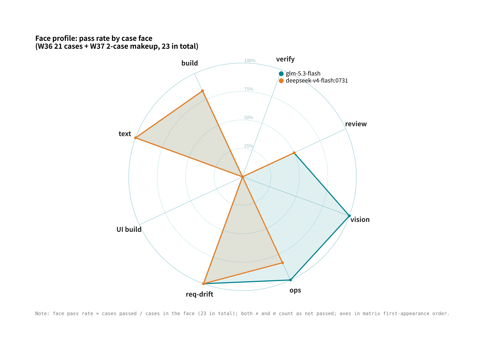
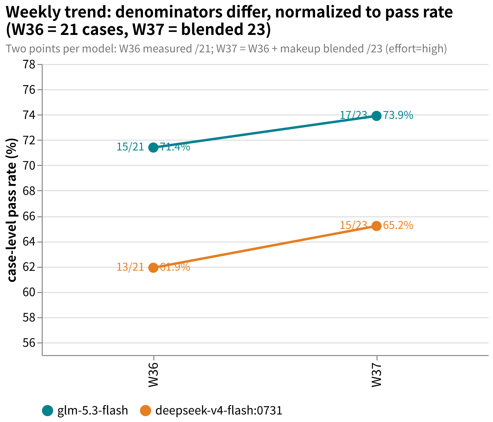

# amber-ollama

Weekly public benchmark results of Ollama Cloud models on the private **AMBER** suite — cases private, results public.
中文： [README.md](README.md)

## What this is

- One issue per week at `results/YYYY-Www.md`: same cases, same effort band, same harness, full library against the model lineup.
- Every issue reports: case-set size and hashes, per-case d2 scores and pass/fail, terminal states, cost and latency, environment fingerprint, and qualitative verdicts written under evidence discipline.
- Cases, oracles, transcripts, and intermediate artifacts are **never published** (see "Publication discipline").
- The AMBER suite spec and case-authoring tools live at [getaskclaw/amber](https://github.com/getaskclaw/amber); the case contents themselves are private.
- Sister repos: [amber-crof](https://github.com/getaskclaw/amber-crof) (CrofAI weekly), [amber-gpt](https://github.com/getaskclaw/amber-gpt) (GPT effort-band weekly).

## Publication discipline (red lines)

1. Publish only: scores and aggregates, cost, latency, qualitative verdicts.
2. Never publish: case content, oracles/graders, transcripts, candidate workspaces, or any intermediate artifact that could reconstruct a case.
3. Every issue pins: model ID, effort band, date (UTC), harness version, and per-case content hashes (bundle_sha). Hashes line up with the public hash manifest in [amber](https://github.com/getaskclaw/amber) so anyone can verify the case set has not changed.
4. Case IDs and case structure are private: public results refer to cases only by stable aliases (A-xxxxxxxx, hash-derived) plus bundle hashes; internal case IDs, variant names, and case descriptions never appear.
5. Tone: this is a community weekly measurement, not an attack on the vendor. Let the data talk; keep wording restrained.

## Charts

- **Report card** (2026-W37, blended 23-case tally = W36 21 cases + 2-case makeup): glm-5.3-flash leads at 17/23, deepseek-v4-flash:0731 at 15/23 — W36 15/21 and 13/21, both 2/2 in the makeup.
  
- **Face profile** (W36 21-case matrix ∪ W37 2-case makeup, grouped by face): glm-5.3-flash is the only vision-face pass and goes 6/6 on ops; d4f:0731 is 5/6 on ops (lost A-a5608487).
  
- **Weekly trend** (W36 to W37, normalized to pass rate as the denominators differ): glm-5.3-flash 71.4%→73.9%, d4f:0731 61.9%→65.2%.
  

## Results index

| Issue | Content | Verdict |
|---|---|---|
| [2026-W36](results/2026-W36.md) | Two models, full library: deepseek-v4-flash:0731 / glm-5.3-flash | glm-5.3-flash 15/21 beats frontier anchor (14/21) + best vision-review score to date; cross-vendor duel proves model name ≠ capability |
| [2026-W37](results/2026-W37.md) | Makeup: the 2 new ops cases (complete the 23-case set) | glm-5.3-flash 17/23 holds the top; d4f:0731 15/23; amber top-3 table flips to 23 cases |

## Disclaimer

Not affiliated with or sponsored by Ollama. Scores are snapshots of a specific week and effort band — not procurement advice.
