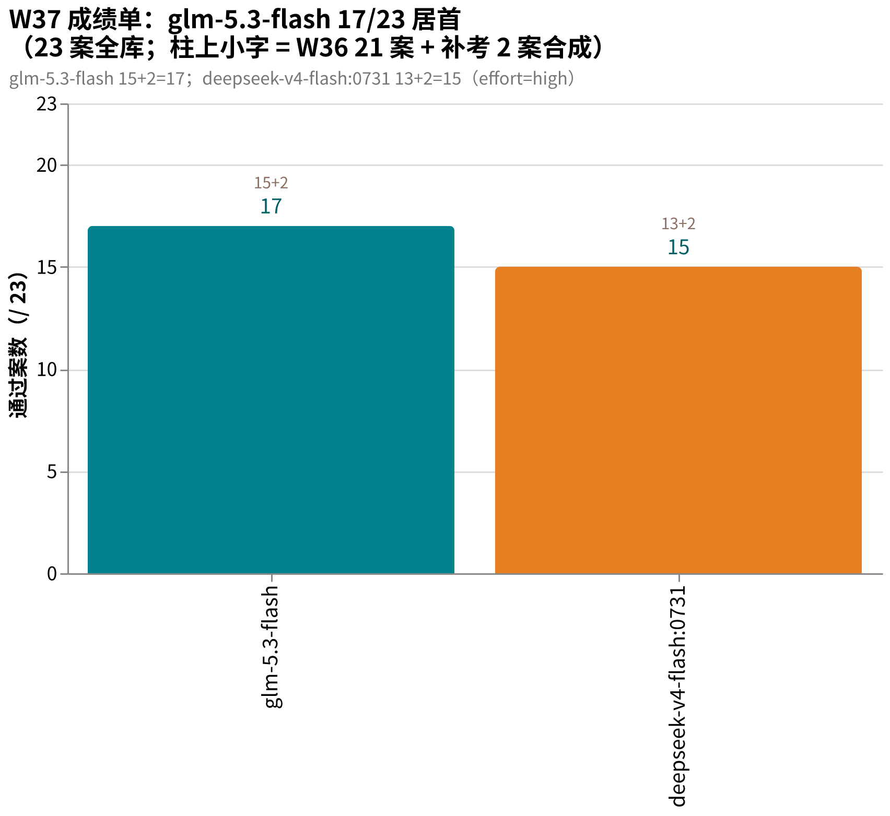
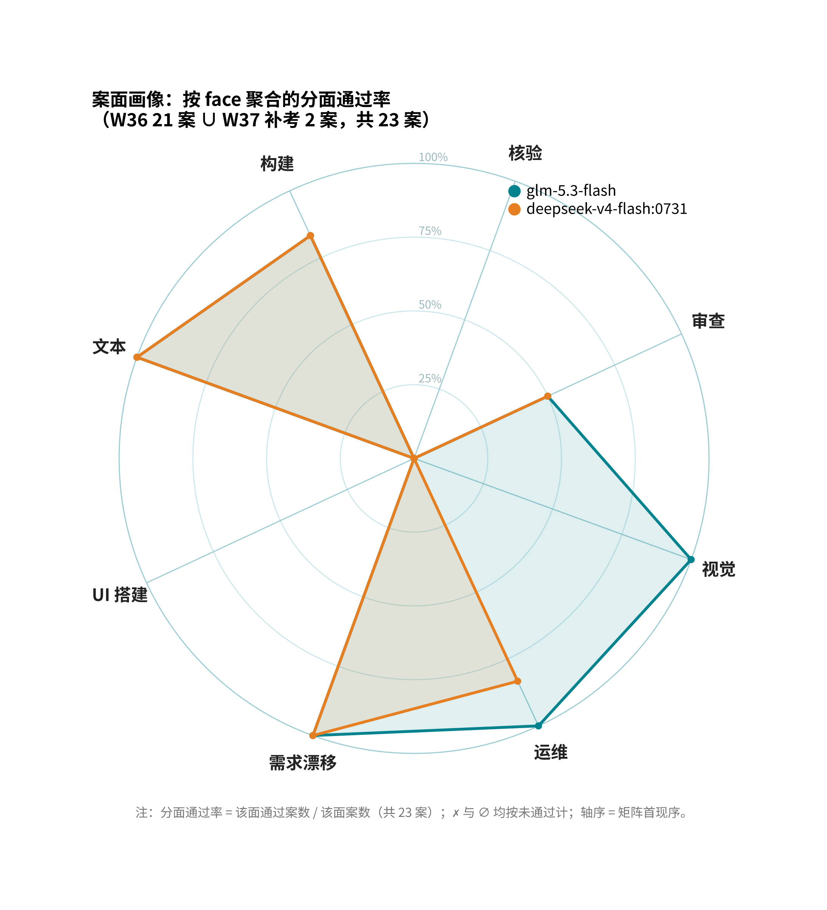
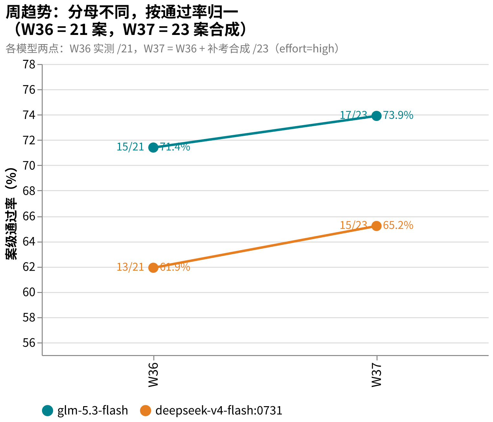

# amber-ollama

用私有题库 **AMBER** 每周实测 Ollama Cloud 模型，只公开结果，不公开题目。
English: [README.en.md](README.en.md)

## 这是什么

- 每周一期 `results/YYYY-Www.md`：同题、同档、同 harness，对在售模型跑全库。
- 一期固定报告：题集规模与哈希、每案 d2 分与通过/失败、终端终态、成本与时延、环境指纹、按证据纪律写的定性裁决。
- 题目、oracle、transcript、中间产物**永不公开**（见下「发布纪律」）。
- AMBER 是 agentic 实战题库（施工/运维/审查/视觉/需求漂移），规范与制题工具见 [getaskclaw/amber](https://github.com/getaskclaw/amber)；考题本体私有。
- 姐妹仓：[amber-crof](https://github.com/getaskclaw/amber-crof)（CrofAI 周测）、[amber-gpt](https://github.com/getaskclaw/amber-gpt)（GPT 档位周测）、[amber-workbuddy](https://github.com/getaskclaw/amber-workbuddy)（WorkBuddy ACP 道）。

## 发布纪律（红线）

1. 只发：分数与聚合、成本、速度、定性裁决。
2. 永不发：题目内容、oracle/判分器、transcript、考生工作区、任何能复原题面的中间产物。
3. 每期必钉：模型 ID、effort 档、日期（UTC）、harness 版本、每案内容哈希（bundle_sha）。哈希用于对照 [amber](https://github.com/getaskclaw/amber) 的公开哈希清单，自证题集未变。
4. 案号与题目结构属私有面：公开结果里案例只用稳定别名（A-xxxxxxxx，哈希派生）+ bundle 哈希作句柄；内部案号、变体名、题目描述永不出现。
5. 基调：这是社区周测，不是对厂商的攻击。数据说话，措辞克制。

## 图说数据

- **本期成绩单**（2026-W37，23 案合成口径 = W36 21 案 + 补考 2 案）：glm-5.3-flash 17/23 居首，deepseek-v4-flash:0731 15/23；两模型 W36 15/21、13/21，补考皆 2/2。（图为主刊时点；09-11 Addendum:deepseek-v4.1-flash 首考 17/23 已与 glm-5.3-flash 并列，图待下期刷新。）
  
- **案面画像**（W36 21 案矩阵 ∪ W37 补考 2 案，按 face 聚合）：glm-5.3-flash 是视觉面唯一通过、运维面 6/6；d4f:0731 运维面 5/6（挂 A-a5608487）。
  
- **周趋势**（W36→W37，分母不同按通过率 % 归一）：glm-5.3-flash 71.4%→73.9%，d4f:0731 61.9%→65.2%。
  

## 双闪对比：glm-5.3-flash vs deepseek-v4.1-flash

2026-09-11 同库（23 案）、同档（high）、同端点（Ollama Cloud）对拍，完整逐案矩阵见 [2026-W37 Addendum](results/2026-W37.md)。

| 维度 | glm-5.3-flash | deepseek-v4.1-flash |
|---|---|---|
| 总分 | 17/23（W37 发布口径）；同日复测 16/23 | 17/23（首考） |
| 编码 / 运维 / 需求 / 文本 | 全绿带内（运维 1 案当场复测才过） | 全绿，运维 6/6 零抖动 |
| UI 构建 | ✗（交付重判 11/12，史上第二高分仍不过线） | ✓（740 秒真实交付） |
| 视觉审查 | 全场唯一通过记录（W36 3.0），本期 2.0 回落地带 | -2，有图像输入但不会审 |
| 归因 / 防御 | 0/15、4/9（归因案塌分复现，端点漂移待确认） | 7/15、4/9 |
| 对抗审查 | -2 | 0（两家均未过线） |
| 输入 tokens / 卷 | 164K | 151K |
| 目录价（in / cached / out） | $0.15 / $0.03 / $0.50 | $0.15 / $0.003 / $0.60 |
| 高峰价（北京 20:00–02:00 工作日） | 不加价 | 全项 2 倍 |

一句话：同价带、同分带——UI 与交付敏感选 deepseek-v4.1-flash，视觉侦察选 glm-5.3-flash，0731 可以让位；但北京工作日夜间（高峰窗）重活选 glm-5.3-flash（此时 d4.1f 账单约 1.7–2.1 倍）。

## 结果索引

| 期 | 内容 | 结论 |
|---|---|---|
| [2026-W36](results/2026-W36.md) | 双模型全库：deepseek-v4-flash:0731 / glm-5.3-flash | glm-5.3-flash 15/21 超前沿锚点（14/21）一案+视觉审查案迄今最高分；同名对决实锤「模型名≠能力」 |
| [2026-W37](results/2026-W37.md) | 新增 2 运维案补考（补齐 23 案） | glm-5.3-flash 17/23 守擂；d4f:0731 15/23；本场后 amber 前三表翻 23 案 |
| ↳ [Addendum 09-11](results/2026-W37.md)（文末） | deepseek-v4.1-flash 首考 + glm-5.3-flash 同日复测 | d4.1f 17/23 并列居首；g53f 复测 16/23（快照带内）；0731 可让位 |

## 免责

与 Ollama 无任何隶属/赞助关系。分数是特定周、特定档位的快照，不构成采购建议。
