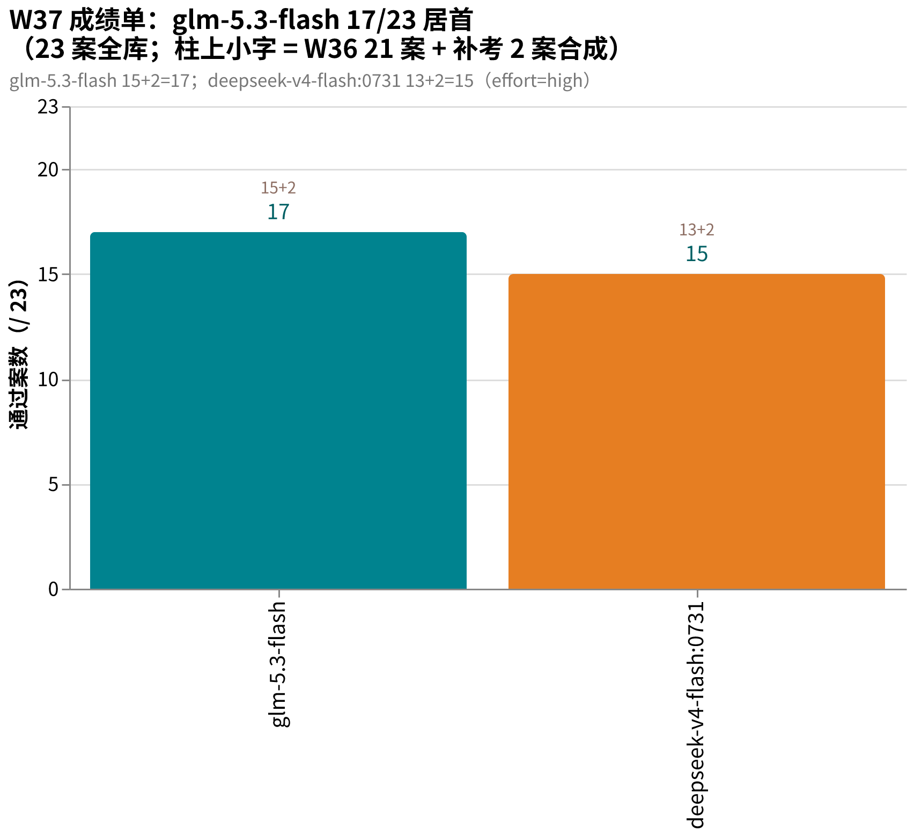
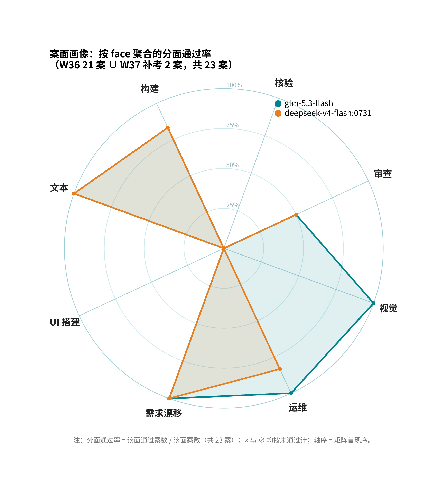
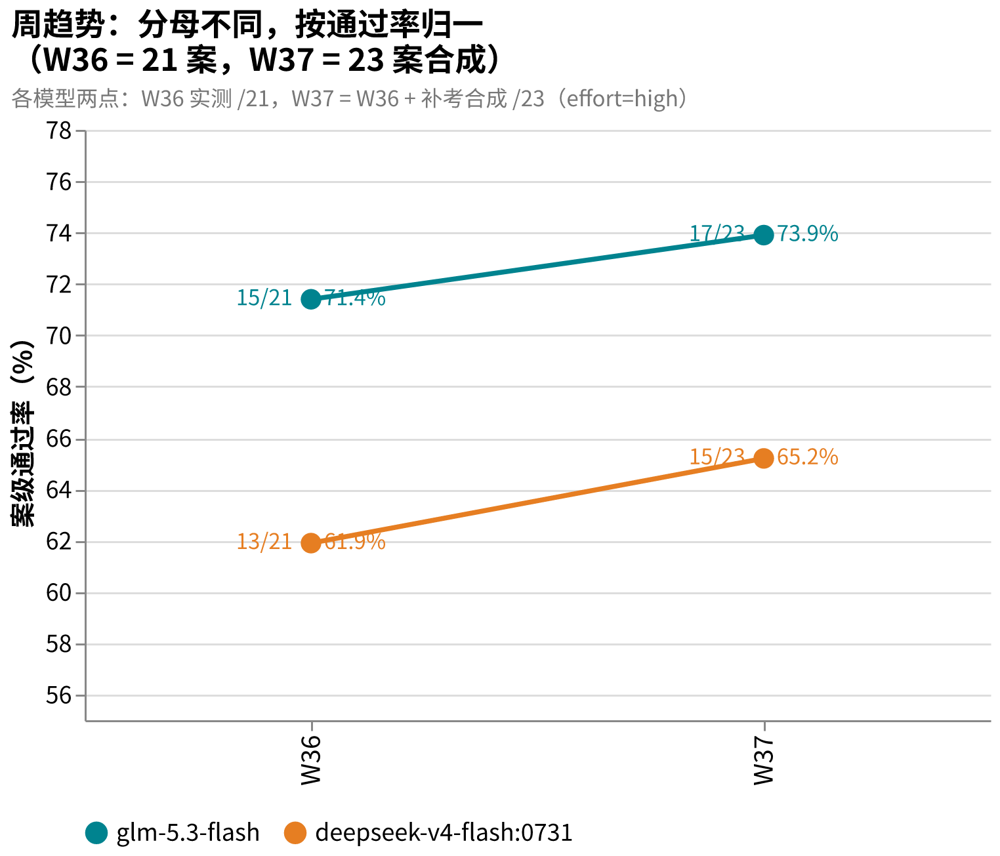

[English](README.en.md) · 简体中文

# amber-ollama

> ⚠️ **更正（2026-10-02，另一项）**：防御轴的一案 A-d511f9e8 在所有车道上改记 NA（考场判的不是考生交付的文件，判分还要求了题面没写的事）。分母不变，**过案数不变**，每条道的总分都带 `'`。本仓各期成绩表里这一格请按 NA 读，其余内容保留原样，以[更正声明](https://github.com/getaskclaw/amber/blob/main/docs/corrections-2026-10-02-a-d511f9e8.md)为准。

> ⚠️ **更正（2026-10-02）**：以下考卷在作答时越出考卷、接触了判分材料，不计胜负。deepseek-v4.1-flash @ Ollama Cloud 有 2 张卷（A-a5608487、A-8d4bc770）改记 NA，成绩 18/24 → **16'/24**。原因是考场隔离缺陷，责任在我们。本页其余内容保留原样，以[更正声明](https://github.com/getaskclaw/amber/blob/main/docs/corrections-2026-10-02.md)为准。

> **2026-10-07 更新**：A-cdc3d11a（审查）：某个审查案上，判分器把一条格式正确的发现里的每个小点都当成一条未经证实的独立断言，又把答案清单之外的真实缺陷当成误报，所以一份正确、格式规范的审查报告也到不了及格线；该案在所有车道上挂起，分母不变，待判分器和考场修好、重新补考后再定。本车道（glm-5.3-flash @ Ollama Cloud）这一格改记 NA（挂起），不记负；该案由负改记 NA 的车道共 27 条，没有重新考试。过案数不变（榜上 18'/24）；负案 5→4，NA 1→2；审查轴 1/2 不变、另有 1 个 NA。本车道榜上成绩是合成口径（W36 全库卷面 + 两个新增运维案的成绩 + 收敛案补测），本案的基线卷面在 [W36 期文](results/2026-W36.md)的矩阵里，未改动，仍是发布时原样；[W37 期文](results/2026-W37.md)文末同日复测的 glm-5.3-flash 列该格已照此改记。见[规范仓 2026-10-07 的更正（A-cdc3d11a）](https://github.com/getaskclaw/amber/blob/main/docs/corrections-2026-10-07-a-cdc3d11a.md)。

用私有题库 **AMBER** 每周实测 Ollama Cloud 模型，只公开结果，不公开题目。

## 成绩一览

<!-- scoreboard:start -->

| 大类 | 轴 | 考什么 | glm-5.3-flash · [W37](results/2026-W37.md) |
|---|---|---|:-:|
| 施工面 | 编码 | 照着需求把功能写对 | 5/6 |
|  | 交付 | 做完还得交得出东西 | 3/3 |
|  | 运维 | 照规程干脏活 | 6/6 |
|  | 需求 | 客户要 A 不要 B | 1/1 |
|  | 收敛 | 真干完，不绕圈装忙 | 1/1 |
| 判断面 | UI | 照设计稿做页面 | 0/1 |
|  | 视觉 | 给真截图挑毛病 | 1/1 |
|  | 防御 | 堵死校验器的漏网口 | 0/2 · 1 NA |
|  | 归因 | 毛病对到正确根因 | 0/1 |
|  | 审查 | 给别人的交付物挑错 | 1/2 · 1 NA |
|  | **合计** |  | **18'/24** |

每格 = 过了几案/该轴共几案（案 = 一道计分题）。NA = 这一案作废或暂停计分，不算过也不算没过；总分带 `'` 表示其中有 NA。多数轴只有 1–2 案，差一案读数就变，所以别把小差距当结论。各列考试周次相同（W37），具体日期可能不同，数字是当期快照。

<!-- scoreboard:end -->

## 这是什么

- 「道」= 同一个模型名在不同家的卖场/接口；「案」= 一道题，「卷」= 一场考试记录（一案多卷 = 一道题的几个变体场次）。

- 每周一期 `results/YYYY-Www.md`：同题、同档、同 harness（跑考试并记分的程序），对在售模型跑全库。
- 一期固定报告：题集规模与哈希、每案找茬分（d2 分，我们的打分，算法不公开）与通过/失败、终端终态（程序跑完时的退出状态）、成本与时延、环境指纹、按证据纪律写的定性裁决。
- 题目、oracle（判分器）、transcript（答题全过程记录）、中间产物**永不公开**（见下「发布纪律」）。
- AMBER 是 agentic 实战题库（施工/运维/审查/视觉/需求漂移——题中要求中途变化），规范与制题工具见 [getaskclaw/amber](https://github.com/getaskclaw/amber)；考题本体私有。
- 姐妹仓：[amber-crof](https://github.com/getaskclaw/amber-crof)（CrofAI 周测）、[amber-gpt](https://github.com/getaskclaw/amber-gpt)（GPT 档位周测）、[amber-devin](https://github.com/getaskclaw/amber-devin)（Devin 周测）、[amber-deepseek](https://github.com/getaskclaw/amber-deepseek)（DeepSeek 官方道）、[amber-commandcode](https://github.com/getaskclaw/amber-commandcode)（CommandCode 道）、[amber-opencode](https://github.com/getaskclaw/amber-opencode)（OpenCode Go 道）、[amber-workbuddy](https://github.com/getaskclaw/amber-workbuddy)（WorkBuddy ACP 道）、[amber-doubao](https://github.com/getaskclaw/amber-doubao)、[amber-goldenpotato](https://github.com/getaskclaw/amber-goldenpotato)、[amber-kimi](https://github.com/getaskclaw/amber-kimi)、[amber-stepfun](https://github.com/getaskclaw/amber-stepfun)。

## 发布纪律（红线）

1. 只发：分数与聚合、成本、速度、定性裁决。
2. 永不发：题目内容、oracle/判分器、transcript、考生工作区、任何能复原题面的中间产物。
3. 每期必钉：模型 ID、effort 档（思考力度档位）、日期（UTC）、harness 版本、每案内容哈希（bundle_sha，每题内容的哈希指纹）。哈希用于对照 [amber](https://github.com/getaskclaw/amber) 的公开哈希清单，自证题集未变。
4. 案号与题目结构属私有面：公开结果里案例只用稳定别名（A-xxxxxxxx，哈希派生）+ bundle 哈希作句柄；内部案号、变体名、题目描述永不出现。
5. 基调：这是社区周测，不是对厂商的攻击。数据说话，措辞克制。

## 图说数据

- **本期成绩单**（2026-W37，23 案合成口径 = W36 21 案 + 补考 2 案）：glm-5.3-flash 17/23 道内居首（全库天梯并列第二），deepseek-v4-flash:0731 15/23；两模型 W36 15/21、13/21，补考皆 2/2。（图为主刊时点；09-11 Addendum:deepseek-v4.1-flash 首考 17/23 已与 glm-5.3-flash 并列，图待下期刷新。）
  
- **案面画像**（W36 21 案矩阵 ∪ W37 补考 2 案，按 face 聚合）：glm-5.3-flash 握本道唯一视觉面通过（全场纪录已易主 swe-2-medium 4.0）、运维面 6/6；d4f:0731 运维面 5/6（挂 A-a5608487）。
  
- **周趋势**（W36→W37，分母不同按通过率 % 归一）：glm-5.3-flash 71.4%→73.9%，d4f:0731 61.9%→65.2%。
  

## 双闪对比：glm-5.3-flash vs deepseek-v4.1-flash

2026-09-11 同库（23 案）、同档（high）、同端点（Ollama Cloud）对拍，完整逐案矩阵见 [2026-W37 Addendum](results/2026-W37.md)。

| 维度 | glm-5.3-flash | deepseek-v4.1-flash |
|---|---|---|
| 总分 | 17/23（W37 发布口径）；同日复测 16/23 | 17/23（首考） |
| 编码 / 运维 / 需求 / 文本 | 全绿带内（运维 1 案当场复测才过） | 全绿，运维 6/6 零抖动 |
| UI 构建 | ✗（交付重判 11/12 仍不过线（全场已有多席 12/12 满分）） | ✓（740 秒真实交付） |
| 视觉审查 | 本道唯一通过记录（W36 3.0；全场纪录现为 swe-2-medium 4.0），本期 2.0 回落地带 | -2，有图像输入但不会审 |
| 归因 / 防御 | 0/15、4/9（归因案塌分复现，端点漂移待确认） | 7/15、4/9 |
| 对抗审查 | -2 | 0（两家均未过线） |
| 输入 tokens / 卷 | 164K | 151K |
| 目录价（in / cached / out） | $0.15 / $0.03 / $0.50 | $0.15 / $0.003 / $0.60 |
| 高峰价（北京 20:00–02:00 工作日） | 不加价 | 全项 2 倍 |

一句话：同价带、同分带——UI 与交付敏感选 deepseek-v4.1-flash，视觉侦察选 glm-5.3-flash，0731 可以让位；但北京工作日夜间（高峰窗）重活选 glm-5.3-flash（此时 d4.1f 账单约 1.7–2.1 倍）。

## 结果索引

| 期 | 内容 | 结论 |
|---|---|---|
| [2026-W36](results/2026-W36.md) | 双模型全库：deepseek-v4-flash:0731 / glm-5.3-flash | glm-5.3-flash 15/21 超前沿锚点（14/21）一案+视觉审查案当时最高分（现纪录 swe-2-medium 4.0）；同名对决实锤「模型名≠能力」 |
| [2026-W37](results/2026-W37.md) | 新增 2 运维案补考（补齐 23 案） | glm-5.3-flash 17/23 守擂；d4f:0731 15/23；本场后 amber 前三表翻 23 案 |
| ↳ [Addendum 09-11](results/2026-W37.md)（文末） | deepseek-v4.1-flash 首考 + glm-5.3-flash 同日复测 | d4.1f 17/23 并列第二梯队（榜首 swe-2-max 18/23）；g53f 复测 16/23（快照带内）；0731 可让位 |
| [2026-W38 更正特刊](results/2026-W38-correction.md) | W38 全库复核:本仓改判 0 格 · 挂起 5 格 | W36/W37 共 5 个矩阵格挂起,车道冻结期内不补考 |

## 免责

与 Ollama 无任何隶属/赞助关系。分数是特定周、特定档位的快照，不构成采购建议。
